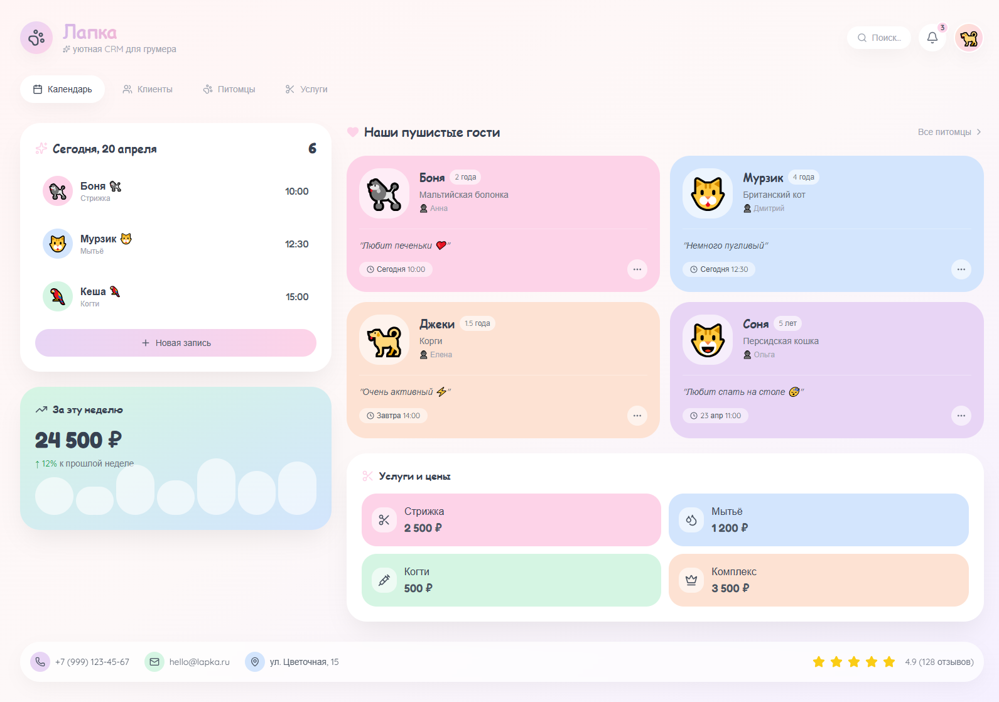
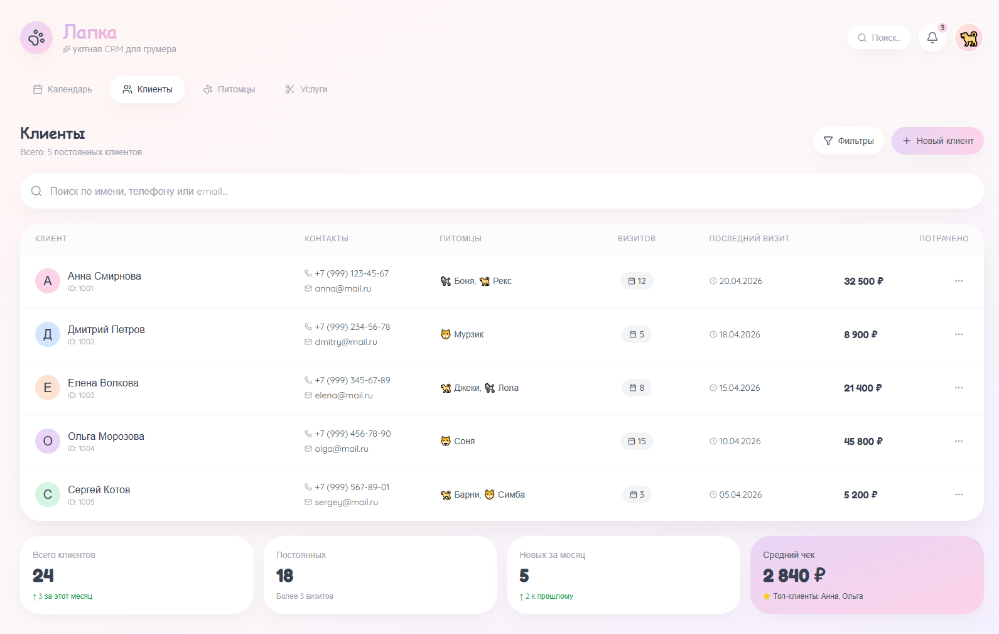
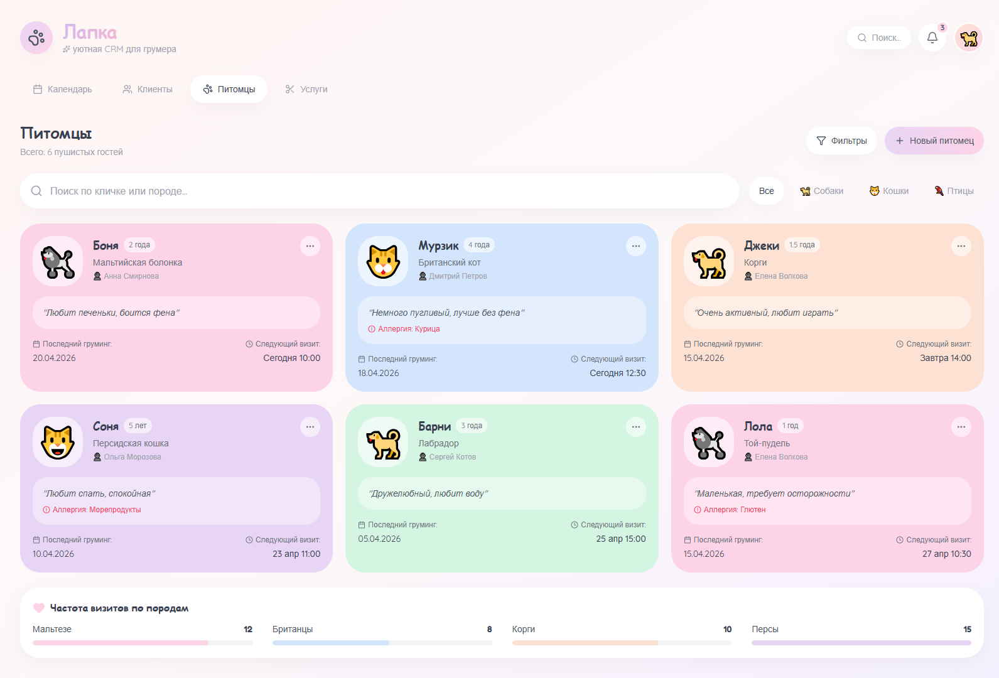
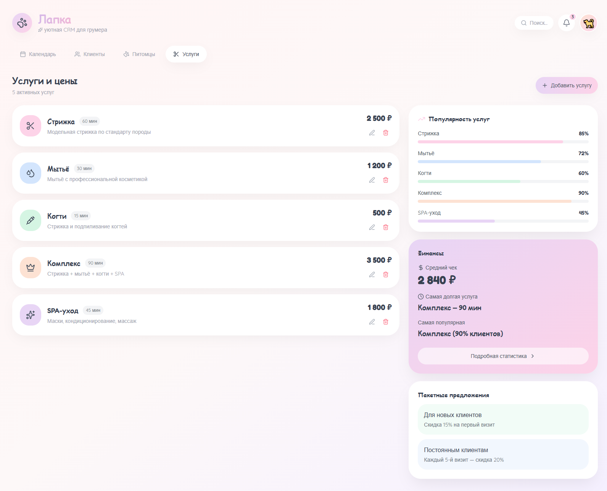

# 🐾 Лапка — CRM для груминг-салон



## О проекте

**Лапка** — визуальный концепт CRM-системы для специалистов по уходу за животными. Интерфейс спроектирован в мягкой пастельной гамме с акцентом на дружелюбное и интуитивное взаимодействие. Проект создан для демонстрации навыков проектирования многостраничных интерфейсов и работы с анимациями.

> Проект является UI-прототипом. Данные статичны, серверная логика отсутствует.

### Возможности адаптации

Архитектура интерфейса легко масштабируется под смежные ниши: салоны красоты, стоматологические клиники, частные детские сады, фитнес-студии. Единая структура «клиент → запись → услуга» универсальна для любого сервисного бизнеса.

## Стек

- React 18 + TypeScript
- React Router (многостраничная навигация)
- Tailwind CSS (кастомная пастельная палитра)
- Framer Motion (анимации и микровзаимодействия)
- Lucide Icons

## Страницы и скриншоты

### 1. Календарь
Главный экран с расписанием на сегодня, списком ближайших записей, карточками питомцев и финансовой статистикой за неделю.


### 2. Клиенты
База клиентов с поиском, фильтрацией и детализацией по каждому: контакты, питомцы, количество визитов и общая сумма затрат.



### 3. Питомцы
Картотека животных с указанием породы, возраста, особенностей характера, аллергий и истории груминга.



### 4. Услуги
Управление прайс-листом: редактирование услуг, длительность, стоимость. Визуализация популярности и финансовая аналитика.



## Дизайн-решения

- **Цвета:** лавандовый, мятный, персиковый, небесный, розовый
- **Типографика:** Quicksand + Fredoka (округлые, дружелюбные шрифты)
- **Скругления:** до 64px для мягкого, «игрушечного» восприятия
- **Анимации:** Framer Motion для появления элементов и тактильных ховеров

## Структура проекта

```
src/
├── pages/
│   ├── Calendar.tsx     # Расписание и дашборд
│   ├── Clients.tsx      # База клиентов
│   ├── Pets.tsx         # Картотека питомцев
│   └── Services.tsx     # Управление услугами
├── App.tsx              # Роутинг и общий layout
├── index.css            # Tailwind + кастомные стили
└── main.tsx
```

## Запуск

```
git clone https://github.com/your-username/lapka-crm.git
cd lapka-crm
npm install
npm run dev
```

## Что демонстрирует проект

- Проектирование многостраничных интерфейсов с роутингом
- Создание эмоционального дизайна через цвет и типографику
- Работу с анимациями на Framer Motion
- Понимание структуры CRM-систем для сервисного бизнеса
- Способность масштабировать UI под различные ниши

